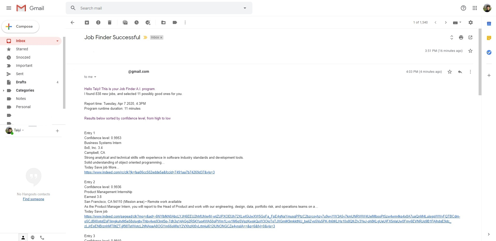
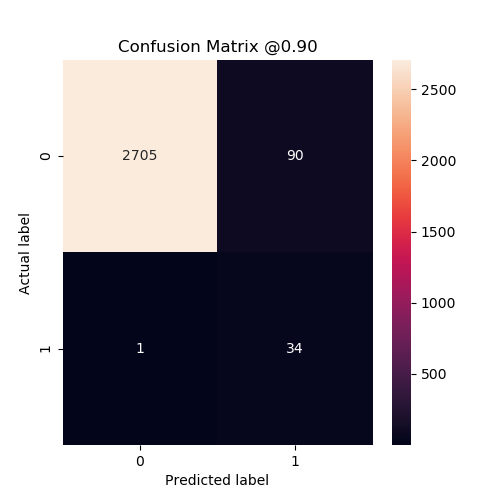
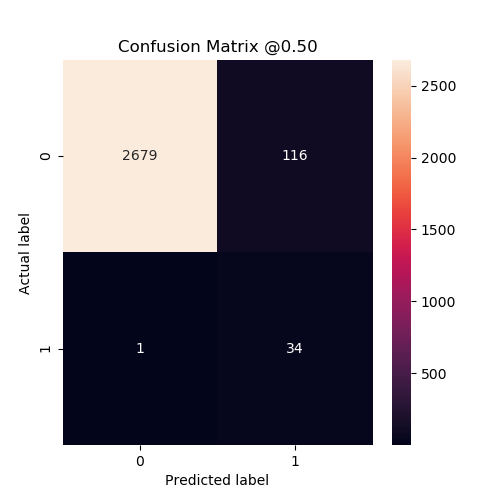
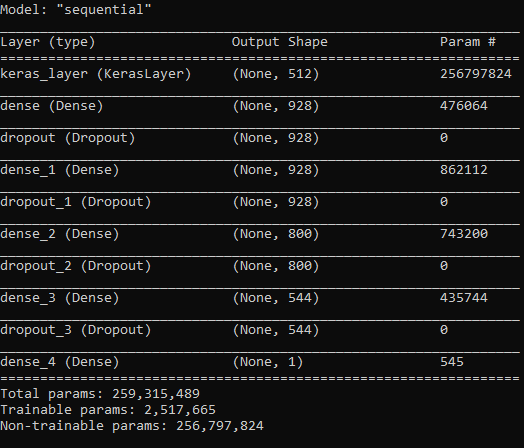

# Job Finder AI
## Powered by: data mining, web automation, deep learning, TensorFlow, Google's Universal Sentence Encoder
Do you find job hunting in this modern world such boring work, just as I do?
Fear not, here is an AI job finder software for you!
The AI learns from your job preferences and automatically browse Indeed everyday
and send you personalized new job recommendations tailored to you.
Say goodbye to hours of your life wasted on chores,
and spend the minimal time to send over resumes.
Focus on what's important in life. Automate away the chores.

In development, this project is divided into 3 parts.
1. Data mining and labeling
  * Utilizes python selenium API to scrap Indeed.com for data
  * Label positive data. Dataset is small.
  * Mine large amounts of negative data. Dataset here is huge.
2. Train, evaluate, and export deep learning model
  * Uses tf.keras API to construct sequential model
  * Model stacks Google's Universal Sentence Encoder module with 3 additional Dense layers plus 1 final output layer
  * Uses class weights to compensate for a highly unbalanced dataset
  * Train to maximize val_auc value (auc: Area Under the Curve)
  * Evaluate based on confusion matrix, true/false postives/negatives, precision and recall
  * Export trained model to Saved Model format
  * Have a dedicated computer as a host tf_server
3. Indeed crawler
  * Uses selenium headless mode for background automation tasks
  * Performs task daily to find new jobs in the area around the human user

In production, the task is shared between 2 computers or virtual machines.
1. Computer A performs daily web crawling on Indeed.com and collects new jobs in the area.
2. Computer B acts as the TensorFlow model server.
3. A collects input data, sends to B.
4. B performs 1 batched feedforward pass on its neural net, and sends output vector to A.
5. A interprets the output vector, and compiles report of its findings, sends to human user.

a sample email report. links provided for easier access to job page. ranked based on probability.

model metrics when evaluated against probability_threshold = 0.9

model metrics when evaluated against probability_threshold = 0.5

model architecture. majority of model is frozen. module through transfer learning from tf_hub
